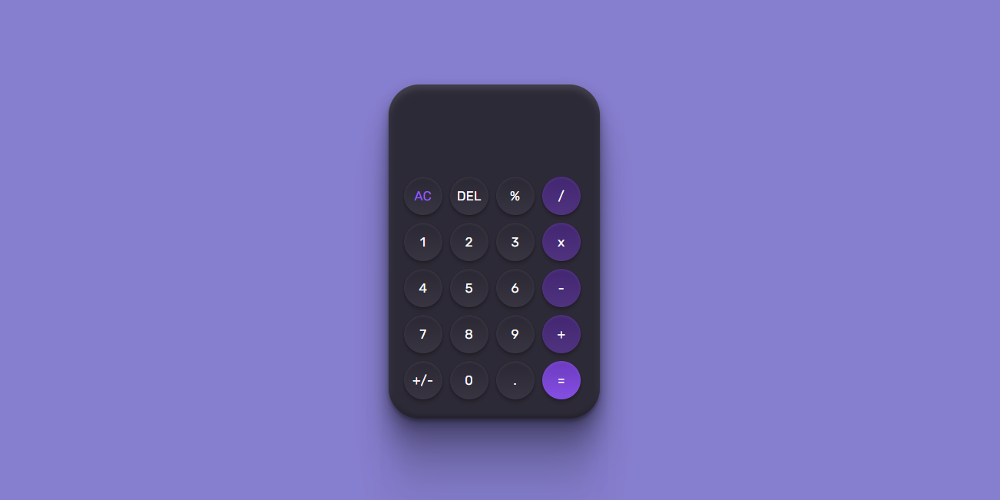

<h1 align='center'>
🎲 Calculator
</h1>

<h1 align='center'>
  
</h1>
<h1 align='center'><a href="">See the site</a></h1>

## 📕 About

Online calculator for quick calculations. 

Users should be able to: 

- Use all the functions of a normal calculator. 
- View the optimal layout depending on their device's screen size 

## 🔨 Tools

- ReactJS
- JavaScript
- Styled-Components